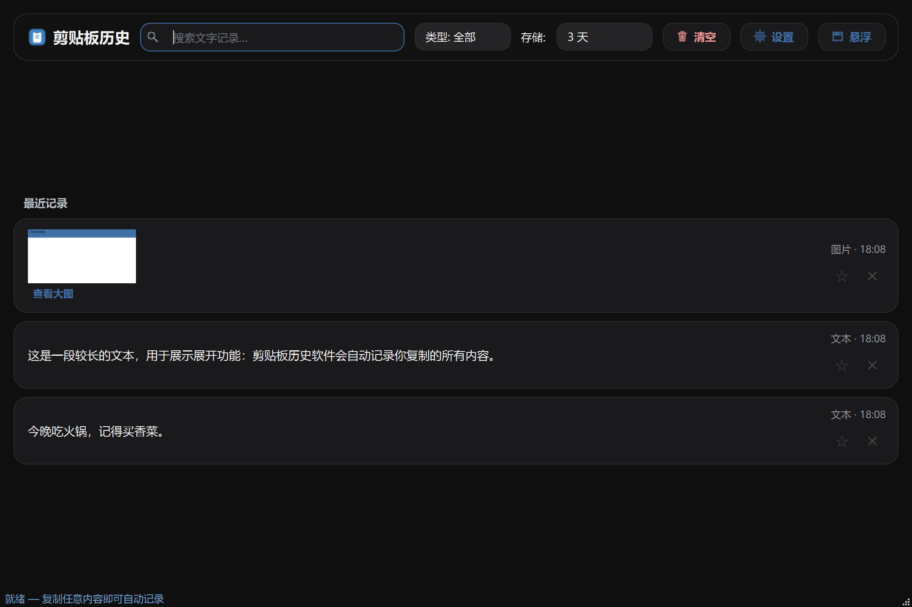
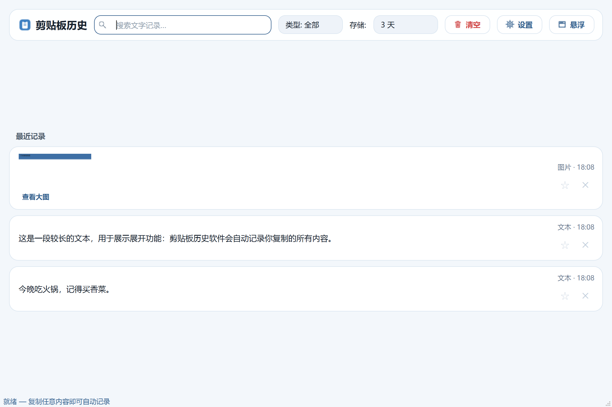
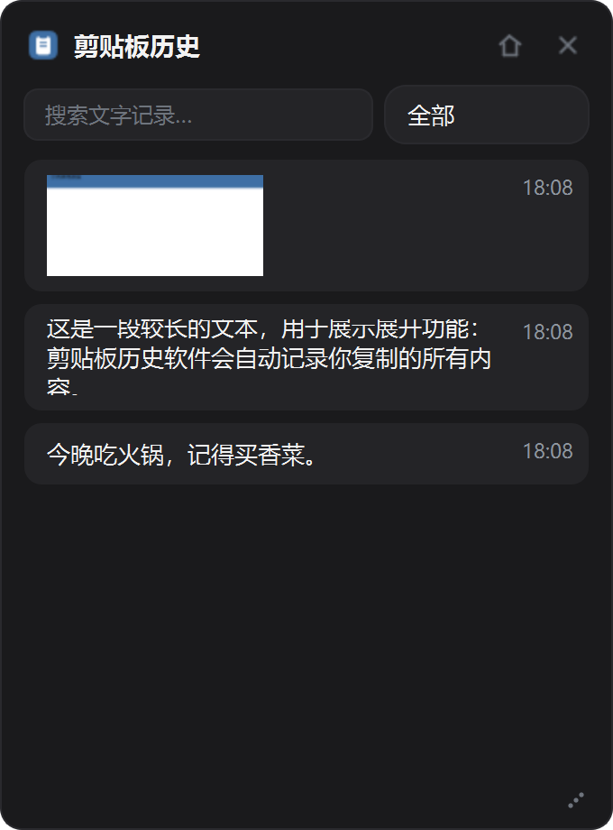

# 📋 Clipboard History · 剪贴板历史

> Windows 11 剪贴板历史软件 —— 自动记录你复制的**文字与图片**，一键再次使用。
> 免安装单文件 exe，数据仅保存在本机，绝不上传。

<p align="center">
  
  
  
  
</p>

## ✨ 功能特性

| 分类 | 功能 |
|---|---|
| 📥 自动记录 | 后台实时监听剪贴板，文字 / 图片自动入库（同内容自动去重合并，不刷屏） |
| 🔍 检索 | 关键词搜索 + **类型筛选**（全部 / 文本 / 图片），可组合使用 |
| ⏳ 存储期限 | 1 / 3 / 5 天可选，到期自动清理；**置顶内容永不过期** |
| 📑 卡片浏览 | 时间降序 + 置顶分组；长文本**一键展开全文**；图片**查看大图预览** |
| 🌗 主题 | **浅色 / 深色 / 跟随系统**三种模式，运行中热切换（Kazumi 风格设计系统） |
| 🫧 桌面悬浮面板 | 常驻置顶小面板，点击卡片即复制；大小可调、位置记忆 |
| ⌨️ 双全局快捷键 | `Ctrl+Shift+V` 主界面唤出/最小化；`Ctrl+Shift+F` 悬浮面板显示/隐藏 |
| 🎛 后台化 | 系统托盘常驻、关闭隐藏、开机自启、单实例、复制历史内容不重复记录 |

## 📸 界面预览

**深色主题（Kazumi 风格）**



**浅色主题**



**桌面悬浮面板**



## 🚀 快速开始（下载即用）

1. 前往 **Releases** 下载 `ClipboardHistory.exe`：<https://github.com/YeZhangrui/clipboard-history/releases/latest>
2. 把 exe 放到任意**有写权限**的目录（桌面、D 盘等；不要放 `C:\Program Files`）
3. **双击 exe** → 淡蓝/深色窗口出现，之后复制任何内容都会被自动记录；
   点击卡片内容即可放回剪贴板，到目标窗口 `Ctrl+V` 粘贴

> 📌 数据保存在 **exe 同目录的 `data/` 文件夹**中（记录库 + 图片），本地存储、不联网不上传。

### 常用操作

- 点卡片 **☆** 置顶（金色，永不过期）｜**✕** 删除
- 顶栏「**类型: 全部**」按文本/图片筛选；搜索框输入关键词实时过滤
- 长文本卡片底部「**展开全文 ▾**」；图片卡片「**查看大图**」
- 关闭窗口 = 藏到托盘继续记录；托盘右键：开机自启 / 悬浮面板 / 退出
- 任意软件里按 `Ctrl+Shift+V` 唤出主界面，`Ctrl+Shift+F` 开关悬浮面板

## 🛠 从源码运行（开发者）

```bash
# 环境：Windows 11 + Python 3.11+
pip install PySide6
python src/main.py          # 启动主界面（+ 后台监听）
python src/main.py --self-test   # 运行自动化自测
```

## 📦 打包为单文件 exe

```bash
python 打包脚本\gen_icon.py        # 生成图标
python -m PyInstaller --noconfirm --clean --onefile --windowed \
  --name ClipboardHistory --icon icon.ico \
  --exclude-module PySide6.QtQml --exclude-module PySide6.QtQuick \
  --exclude-module PySide6.QtWebEngineCore src\main.py
```

或直接双击 `打包脚本\build.bat`，产物在 `dist\ClipboardHistory.exe`。

## 📁 项目结构

```
├── src/                    # 源代码
  ├── main.py              # 入口（单实例 / 监听 / 托盘 / 热键组装）
  ├── clipboard_watcher.py # 剪贴板监听（文本/图片、去重、抑制自身）
  ├── database.py          # SQLite 数据层（类型检索 / 清理 / 置顶）
  ├── theme.py             # 主题管理（浅色/深色/跟随系统）
  ├── hotkey.py            # 全局热键（注册 + 消息路由）
  ├── tray.py / autostart.py / config.py / image_store.py
  └── ui/                  # 主窗口 / 卡片 / 悬浮面板 / 设置 / 样式
docs/                      # 需求、技术、设计、开发计划、日志规范
devlogs/                   # 开发日志（v1.0 → v1.20 全程记录）
打包脚本/                   # build.bat + 图标生成
test_ui.py                 # 界面冒烟测试
```

## 📖 文档

| 文档 | 说明 |
|---|---|
| [docs/requirements.md](docs/requirements.md) | 需求规格说明书（含验收标准） |
| [docs/technology.md](docs/technology.md) | 技术方案（架构 / 数据设计 / 实现要点） |
| [docs/design.md](docs/design.md) | UI/UX 设计规范（Kazumi 风格双主题） |
| [docs/development-plan.md](docs/development-plan.md) | 开发计划与质量门禁 |

## 🔒 数据与隐私

- 所有记录仅存于本机 `data/` 目录，**软件不联网、不上传**
- 开源仓库不包含用户数据（`data/` 已在 `.gitignore` 中排除）

## 📄 License

本项目目前**未指定开源许可证**。如需再分发、商用或协作，请联系作者获取授权。

---

<p align="center">
  <sub>用 ❤️ 为 Windows 11 打造 ｜ 反馈问题请到 <a href="https://github.com/YeZhangrui/clipboard-history/issues">Issues</a></sub>
</p>
